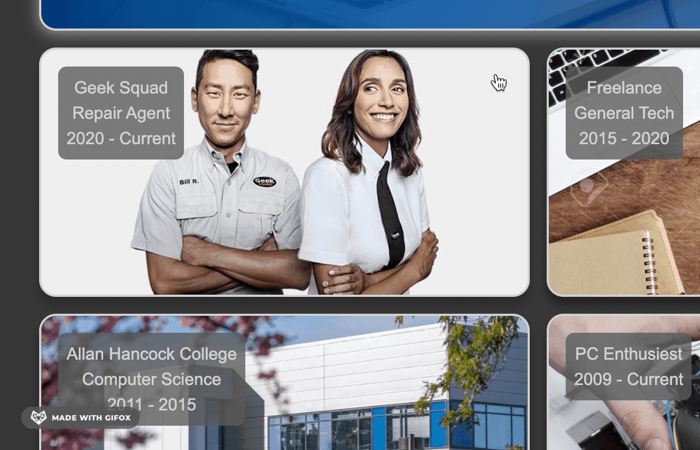

# My Portfolio

This is a portfolio peice to show work i've done. I'm mostly focusing on flex for this project and how it can dynamically fit items on the screen to any window size well.

This helps me deliver a page that fits to any device and look the way I want.

Features:

<ul>
<li>Flex, dynamically changing sizes fit window width accordingly</li>
<li>Responsive design, this page will respond to feedback with mouseover</li>
<li>These links are peices Ive done, links fully functional with a contact me page</li>
<li>Hosted on Github, feel free to check the web page at the bottom of the page</li>
</ul>

Example of the resizing the page supports

Example of Window highlighting

This site has some great useful items in it that I think are great!

https://kh288.github.io/My-Portfolio/

[LICENSE](/LICENSE.txt)